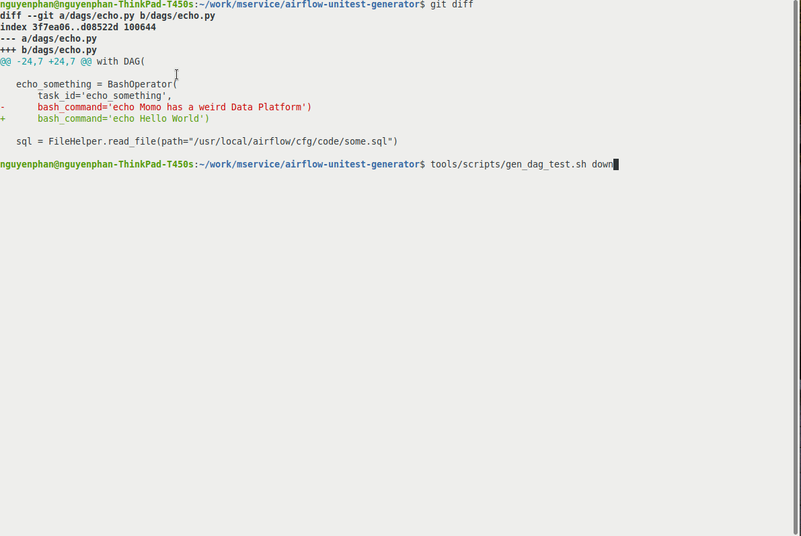

# Airflow Unittest Generator

## About

This is an Docker solution for generating test of Airflow's Operator. Which would help you generate simple Airflow Unittest without having acttually install Airflow.

## How to run it

You should have:

- Install Docker
- install docker-compose
- `cd <your folder>`
- `git clone https://github.com/khoinguyen1312/airflow-unitest-generator`
- execute `tools/scripts/gen_dag_test.sh`
- See results, it should be as same as before

## Try to see the different by editing code

This solution's target is to help you seeing code change's affection everytime we edit our production code.

Try something like:

- Edit bash command of task `echo_something` in `dags/echo.py` to `echo Hello World`.
- That, trigger the script `tools/scripts/gen_dag_test.sh` again.
- Check code different by Git tools or simply `git diff`.
- Now, we should see the different in `pytest/airflow/dags/auto_generate_result/code/echo_dag_auto_test.py`.

## Commands

- `tools/scripts/gen_dag_test.sh` Allow you to generate test and keep airflow running at <http://localhost:8080> for checking for DAG.
- `tools/scripts/gen_dag_test.sh down` Allow you to remove docker container after test generating.
